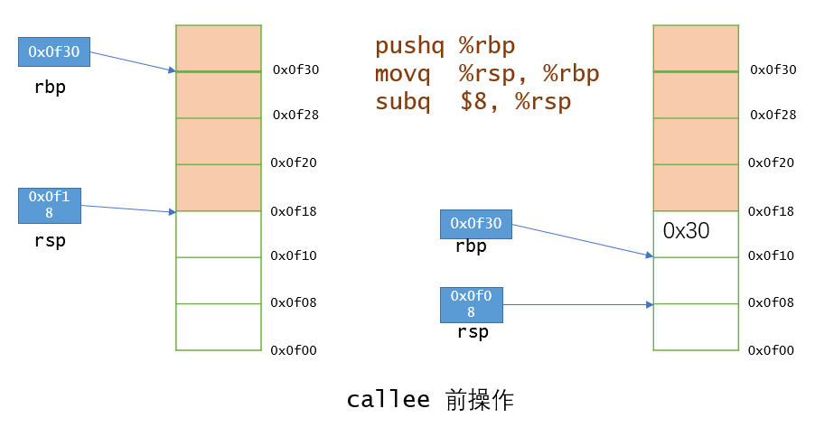
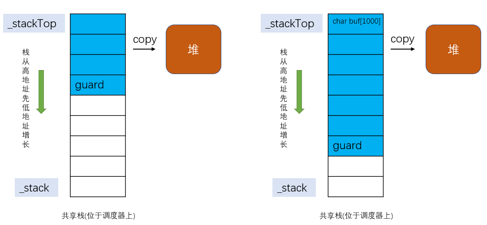
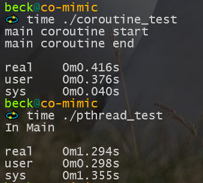

## 1. 基于ucontext的协程库


ucontext的相关介绍：
https://man7.org/linux/man-pages/man3/makecontext.3.html

---

### 1.1. 协程是什么？

协程的基本原理就是：当一个函数运行的时候，都会有自己的上下文(寄存器、堆栈)。不同函数的上下文加载到CPU上，那么CPU自然会运行不同的函数。基于这个思想，我们保存不同函数的上下文到某个地方，然后通过调度程序来加载不同函数的上下文（比如依次遍历），从而实现协程切换。可以看出，协程其实就是不同函数的执行过程。

<br>
 
---
### 1.2. 协程的优势是什么？

1. 一个线程内可以由很多个协程，协程之间不需要复杂的锁机制和条件变量来保证不同协程之间的贡献资源一致性。之所以不需要我觉得应该是写法上的区别，写协程基本就是A协程干完自己的事情，就yield让出CPU，然后调度到让B协程继续执行。 因此应该尽量使用异步函数，libco里面hook了阻塞的函数，从而将阻塞的函数改造为异步函数，从而防止协程阻塞导致线程阻塞，避免其他协程不能执行的情况。
2. 由于协程是处于同一个线程内，资源都是共享的，因此数据的局部性会非常好，也就是是说，cache的命中率会高很多。

<br>
 
---

### 1.3. 基于ucontext的协程是会陷入内核的！

glibc里面getcontext的源码：

```asm
    movq	%rbx, oRBX(%rdi)
	movq	%rbp, oRBP(%rdi)
	movq	%r12, oR12(%rdi)
	movq	%r13, oR13(%rdi)
	movq	%r14, oR14(%rdi)
	movq	%r15, oR15(%rdi)

	movq	%rdi, oRDI(%rdi)
	movq	%rsi, oRSI(%rdi)
	movq	%rdx, oRDX(%rdi)
	movq	%rcx, oRCX(%rdi)
	movq	%r8, oR8(%rdi)
	movq	%r9, oR9(%rdi)

	movq	(%rsp), %rcx
	movq	%rcx, oRIP(%rdi)
	leaq	8(%rsp), %rcx		/* Exclude the return address.  */
	movq	%rcx, oRSP(%rdi)
```

网上说协程的之所以快是因为协程调度不会陷入内核，但是通过查看swapcontext源码发现并非如此：
```
/* Save the current signal mask and install the new one with
	   rt_sigprocmask (SIG_BLOCK, newset, oldset,_NSIG/8).  */
	leaq	oSIGMASK(%rdi), %rdx
	leaq	oSIGMASK(%rsi), %rsi
	movl	$SIG_SETMASK, %edi
	movl	$_NSIG8,%r10d
	movl	$__NR_rt_sigprocmask, %eax
	syscall
	cmpq	$-4095, %rax		/* Check %rax for error.  */
	jae	SYSCALL_ERROR_LABEL	/* Jump to error handler if error.  */
```
通过上面代码可以看出，这个系统调用是`__NR_rt_sigprocmask`，从名字上可以推断出是和信号相关的系统调用，这也是为什么基于ucontext实现的协程比其他协程慢的原因，基于汇编自己实现的协程库，都没有处理信号，因此会快一些。


ucontext只是实现协程的一种方式，还有其他方式(`ucontext`、`setjmp/longjmp`、`纯汇编`、`windows fiber`)来实现协程，以libco为例，它使用汇编实现的上下文切换函数：
```c++
    leaq (%rsp),%rax
    movq %rax, 104(%rdi)
    movq %rbx, 96(%rdi)
    movq %rcx, 88(%rdi)
    movq %rdx, 80(%rdi)
    movq 0(%rax), %rax
    movq %rax, 72(%rdi) 
    movq %rsi, 64(%rdi)
    movq %rdi, 56(%rdi)
    movq %rbp, 48(%rdi)
    movq %r8, 40(%rdi)
    movq %r9, 32(%rdi)
    movq %r12, 24(%rdi)
    movq %r13, 16(%rdi)
    movq %r14, 8(%rdi)
    movq %r15, (%rdi)
    xorq %rax, %rax

    movq 48(%rsi), %rbp
    movq 104(%rsi), %rsp
    movq (%rsi), %r15
    movq 8(%rsi), %r14
    movq 16(%rsi), %r13
    movq 24(%rsi), %r12
    movq 32(%rsi), %r9
    movq 40(%rsi), %r8
    movq 56(%rsi), %rdi
    movq 80(%rsi), %rdx
    movq 88(%rsi), %rcx
    movq 96(%rsi), %rbx
    leaq 8(%rsp), %rsp
    pushq 72(%rsi)

    movq 64(%rsi), %rsi
	ret
```
可以看出，libco的实现就没有使用系统调用，因此会快很多。

<br>
 
---

### 1.4. 协程是如何保存上下文的？

```
pushq   %rbp
movq    %rsp, %rbp
subq    $8, %rsp
```
该过程的图示如下：



`push *` 等效于
```
sub $8, %rsp
mov *, (%rsp)
```

而`pop *`则相当于：
```
mov (%rsp), *
add $8, %rsp
```

因此，当切换到另一个协程时，先用push把上一个协程的栈底指针压到栈顶，这个时候%rsp也会相应的调整，移动一个指针的大小(8 byte)，如上图右边所示。除了保存上一个协程的栈，可以看到还执行了`subq    $8, %rsp`将%rsp寄存器减8，这是为callee分配了8字节大小的空间。

<br>

---

### 1.5. 协程执行过程中，栈是动态变化的，如何处理应对？

因为协程执行过程中栈是动态变化的，因此要么：
1. 在调度器的函数栈上分配一个特别大的空间，每创建一个协程，我们就为其分配一个定长为n的栈，但是这样会造成巨大的浪费，因为n是最大值，很有可能大部分协程远远用不到这么大的空间。
2. 使用malloc将协程的栈分配在堆上，当我们执行协程时，是在调度器的一块共享内存上执行的(也可以叫共享栈，其他协程也是在这块共享栈上执行的)，当我们保存协程的栈时，只需要将调度器的这块共享内存copy到堆上，当下一次再调度到这个协程时，只需要将刚刚保存到堆上的内存copy回调度器的共享内存上就可以了。如下图：

我们使用了一个栈上的char变量guard，因为它的地址就是栈顶的地址，因此可以根据栈底地址和guard的地址来确定栈的大小。除此之外，还可以用`register long rsp asm ("rsp");`这句汇编代码来获取rsp的值，可以避免8 byte空间带来的开销。注意这里rsp变量没有对它取地址，因此不会在栈上给它分配空间，而是会把它放到寄存器中。

在本实现中，使用了第二种方法。


<br>
 

---

### 1.6. 编译命令：
```c++
g++  -g -Wall -O0 -march=native -std=c++17 -Wno-reorder -pthread -I.   -c -o coroutine.o coroutine.cpp
g++  -g -Wall -O0 -march=native -std=c++17 -Wno-reorder -pthread -I.   -c -o main.o main.cpp
g++ -o main coroutine.o main.o  -g -Wall -O0 -march=native -std=c++17 -Wno-reorder -pthread -I.
```

<br>
 
---

### 1.7. 对比pthread



<br>
 

---

### 1.8. 结论
可以看出，协程相对于pthread的内核级线程，其sys时间几乎可以忽略，这就是避免陷入内核的好处：节约了CPU cycle，提高了性能！

<br>
 

---

### 1.9. 新东西
1. 使用C++ 17的std::any来代替void*
2. 使用内联汇编来获取%rsp避免不必要的开销
3. 使用迭代器代替id，避免查询耗时
4. 使用智能指针管理协程栈，避免内存泄漏
5. 使用std::function来保存调用目标，支持lambda函数
6. 增加coroutine和pthread的对比

<br>
 

---

### 1.10. 参考
[云风的 BLOG: C 的 coroutine 库](https://blog.codingnow.com/2012/07/c_coroutine.html)

[getcontext GLIBC源代码](https://github.com/bminor/glibc/blob/master/sysdeps/unix/sysv/linux/x86_64/getcontext.S)

[tencent libco](https://github.com/Tencent/libco)


